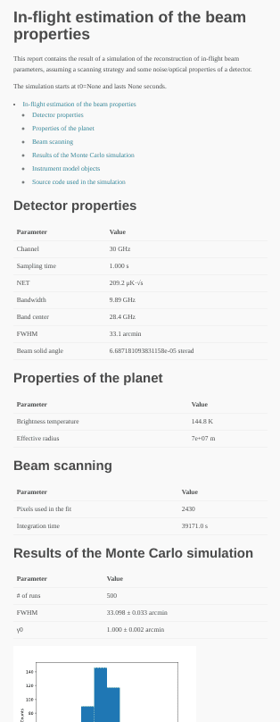

# Simulation of in-flight beam calibration

This repository contains the source code used to run the simulations
for reconstructing the in-flight beam calibration of LiteBIRD and
Planck detectors.

The code runs using Python 3.7+ and the
[litebird_sim](https://github.com/litebird/litebird_sim) framework.

You must run the code in two steps:

1. Simulate the scanning strategy (long!) using `simulate_scanning_strategy.py`;
2. Run the Monte Carlo simulation (short) using `symmetric_gaussian_beam_fit.py`.

Both scripts need a TOML file as input; the repository contains a set
of examples. If you want to run the examples simulating LiteBIRD, you
must first set up the IMO; if you're a member of the LiteBIRD
collaboration, contact the [LiteBIRD Simulation
Team](mailto:litebird_pipe@db.ipmu.jp) for details.

Both scripts produce a Markdown/HTML report, similar to this:

